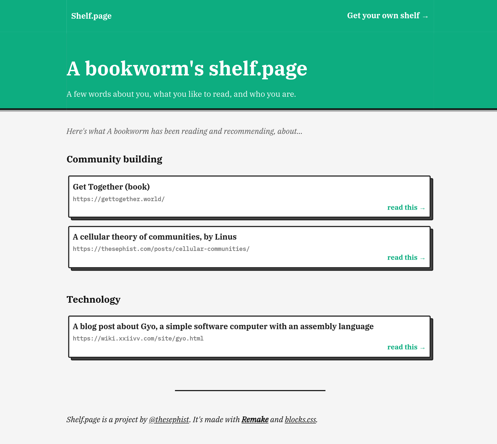

# Shelf.page 🪂

I used to keep a [list of some of my favorite reads online](https://linus.zone/technical-reading) and share it on Twitter, but keeping it updated became a chore, and I wanted a more beautiful place to share my favorite reads online.

So I made [Shelf.page](https://shelf.page/)! It's your online, public bookshelf, blog-shelf, newsletter-shelf, anything-else-you're-reading-shelf. You can add links to your favorite articles, blogs, and issues of newsletters, grouped by topic.

Here's mine, at [shelf.page/thesephist](https://shelf.page/thesephist).

## Built with Remake

Shelf.page was my first project in [Remake](https://remaketheweb.com/), a web app framework that makes prototyping projects lightning fast. A blog post about Remake and Shelf.page is coming soon!

Shelf.page also owes its visual style to [blocks.css](https://thesephist.github.io/blocks.css/), a simple CSS library for the "blocky" aesthetic of Shelf.page.

